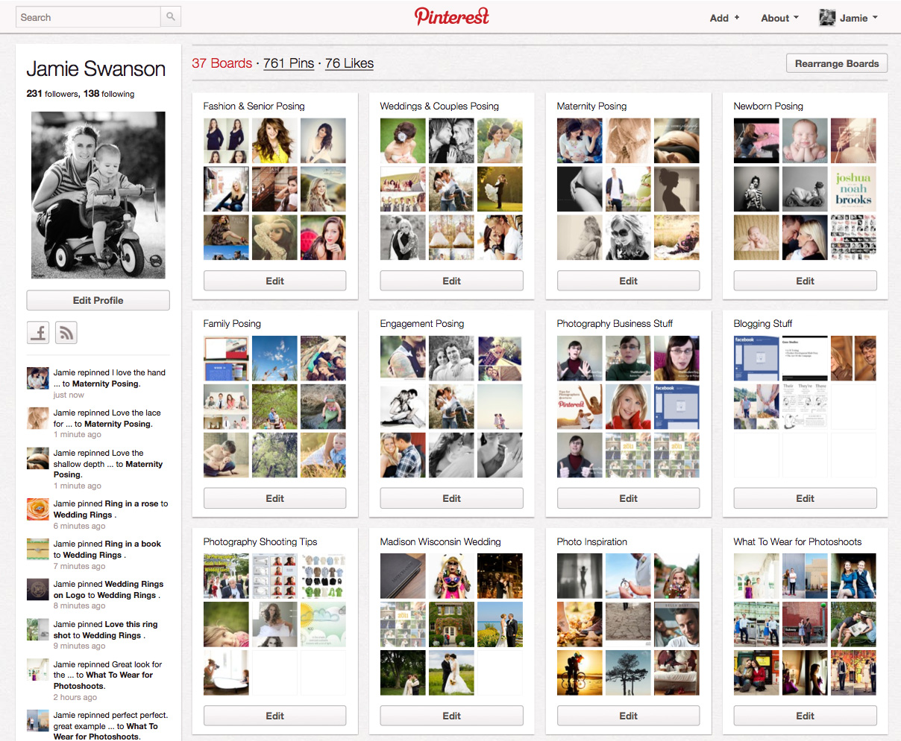

# Pinteresting - Pinterest Clone

For this project, we're going to explore Ruby on Rails by creating a clone of the popular website [Pinterest.com](http://pinterest.com). I encourage you to create an account and try it out.

### Phase 1: Design Phase
It is useful to sit down and write out what you think you will need to build for our application. Our videos will cover a very specific features like user login/signup, file upload, etc. but what else do you want to allow your users to do?

At its core, Pinterest allows users to have a profile and share "pins" to their profile. It also allows them to be organized into "boards". What other features do you think would be useful for this app?

I would recommend starting with the core feature set before adding features like following other users or tagging pins.

### Phase 2: Creating our Rails App

Go ahead and create a new Rails app and a Github repository. Add git tracking to your Rails project and make sure you can push your code up to your Github repository.

### Phase 3: Add Bootstrap to our Project
* [Use Bower to Install Bootstrap](./bootstrap.md)

### Phase 4: Add our user registration system

We will be using the [Devise gem](https://github.com/plataformatec/devise) for our user registration.

We need to use Devise to let our users create an account (sign up) and/or login to our application.

Once we have our user accounts, we can start to enforce certain behaviors such as not allowing someone to delete a pin that isn't theirs.

* [Use Devise to create a user registration system](./devise.md)

### Phase 5: Deploying to Heroku
[Heroku](http://heroku.com) is a service that will host our Pinteresting project and make it possible for other people to access our application.

This will be covered in class on 5/19.

[Using Rails 4 on Heroku](./heroku.md)

### Phase 6: Allow users to upload images for their pins
We will be using two tools for this, which will be covered in class during week 8.

1. Paperclip Gem
  * [Image uploading with the Paperclip gem](https://www.youtube.com/watch?v=Z5W-Y3aROVE)
  [documentation](https://github.com/thoughtbot/paperclip)
  * Requires ImageMagick to be installed
2. Amazon S3
  * Using Amazon S3 with Paperclip

## Videos on Youtube
1. [Using Devise](https://www.youtube.com/watch?v=qV9JFO7k-Dk)
2. [Adding Bootstrap](https://www.youtube.com/watch?v=K17A1ky8HeA)
3. [Creating our Pins](https://www.youtube.com/watch?v=TBhltBex2ts)
4. [Associating Users with Pins](https://www.youtube.com/watch?v=e5h2zEnX-tw)
